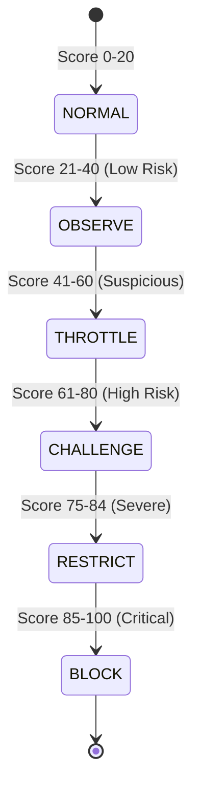

# AgentShield Architecture & Design Specification

> **Positioning:** Runtime protection against unauthorized autonomous agents, automation, and abusive clients.
> **Philosophy:** *Detect behavior → calculate risk → understand intent → enforce policy.*

---

## 1. System Overview

AgentShield is a privacy-first, zero-external-dependency security engine designed to detect, classify, and mitigate unauthorized automated behavior, autonomous browser agents, scraping scripts, and API abuse targeting modern web applications.

AgentShield operates locally within the host runtime (Node.js, Express, Next.js, Edge) without requiring cloud accounts, LLMs, GPUs, or external third-party API calls.

```mermaid
flowchart TD
    Client[Client / Browser / Agent] -->|HTTP Request| Middleware[AgentShield Node / Next Middleware]
    BrowserSDK[@agentshield/browser SDK] -.->|Privacy-Safe Signals| Correlation[Correlation Endpoint /_agentshield/events]
    Correlation -.-> Engine[Core Detection Engine]
    
    subgraph CoreEngine [Detection Engine Architecture]
        RequestNormalizer[Request Normalizer] --> SessionLookup[Session Store: Memory / Redis]
        SessionLookup --> FeatureExtractor[Feature Extractor]
        FeatureExtractor --> RiskModels[Risk Models: RuleBased + Statistical]
        FeatureExtractor --> GraphEngine[Application Behavior Graph]
        
        RiskModels --> RiskScorer[Explainable Risk Scorer 0-100]
        GraphEngine --> RiskScorer
        RiskScorer --> IntentClassifier[Intent Classifier]
        
        IntentClassifier --> PolicyEngine[Policy Engine]
        PolicyEngine --> Decision[Enforcement Action: ALLOW / THROTTLE / CHALLENGE / RESTRICT / BLOCK]
    end
    
    Middleware --> RequestNormalizer
    Decision --> Middleware
    Middleware -->|Response / Action| Client
```

---

## 2. Package Boundaries & Responsibilities

The monorepo is architected around strict separation of concerns, zero circular dependencies, and framework independence:

| Package | Purpose | Runtime Constraints |
| :--- | :--- | :--- |
| **`@agentshield/shared`** | Pure TypeScript domain types, contract interfaces, event maps, graph models. | No runtime dependencies. Universally importable by browser, node, edge. |
| **`@agentshield/core`** | Algorithmic detection engine, feature extraction, explainable scoring, intent classification, policy engine, graph engine, memory store, and event bus. | 100% framework-independent. Zero Node or Browser API dependencies. Sub-millisecond synchronous evaluation. |
| **`@agentshield/node`** | Express & Fastify middleware, request normalization, privacy-safe IP hashing, response throttling, challenge interception, and telemetry ingestion. | Node.js >= 18. Peer dependency on Express. |
| **`@agentshield/browser`** | Lightweight client telemetry (< 5KB). Collects timing, interaction entropy, and automation flags without capturing text, keystrokes, or PII. | Browser DOM environment (React, Next.js, Vite, Vanilla JS). |
| **`@agentshield/next`** | Next.js App Router, Route Handlers, and Edge-compatible middleware wrapper. | Next.js >= 13. Edge Runtime compatible where possible. |

---

## 3. Core Component Contracts

### 3.1 DetectionEngine
The orchestrator that ingests a `NormalizedRequest`, fetches session context, extracts features, calculates explainable risk scores, predicts intent, evaluates policy rules, and triggers lifecycle events.

### 3.2 RiskModel & FeatureExtractor
Separates feature engineering from risk inference:
- **`FeatureExtractor`**: Derives continuous and discrete metrics (e.g., `burstRatePer10Sec`, `error404Ratio`, `sequentialResourceIdCount`, `interactionVariance`, `hasAutomationIndicators`).
- **`RiskModel`**: Evaluates features deterministically via `RuleBasedModel` and `StatisticalModel`, with an interface allowing future `XGBoostModel` or `LightGBMModel` pluggability.

### 3.3 Application Behavior Graph
Learns and enforces natural user route traversal:
$$\text{Home} \longrightarrow \text{Products} \longrightarrow \text{Product Detail} \longrightarrow \text{Cart} \longrightarrow \text{Checkout}$$
Detects abnormal transitions, direct deep jumps to administrative or sequential resource endpoints, and unexpected graph anomalies.

### 3.4 Policy Engine & Progressive Mitigation
Enforces actions based on risk level, intent, and route sensitivity:


---

## 4. Privacy & Data Minimization

AgentShield implements strict privacy-by-design standards:
1. **Never collected:** Request bodies, passwords, form inputs, keystrokes, clipboard contents, screenshots, or page DOM contents.
2. **IP Protection:** Client IP addresses are never stored in raw plaintext; they are transformed via salted one-way hashing (`ipHash`).
3. **Session Pseudonymity:** Browser telemetry uses pseudonymous session tokens that expire automatically.
4. **Local Evaluation:** Zero data leaves the application boundaries.

---

## 5. Performance SLA

- **Local in-memory evaluation latency:** $< 1\text{ ms}$ per request.
- **Zero blocking external I/O:** Evaluation does not stall on third-party APIs.
- **Batched Browser Telemetry:** Signal updates are batched and sampled to preserve bandwidth and battery.
